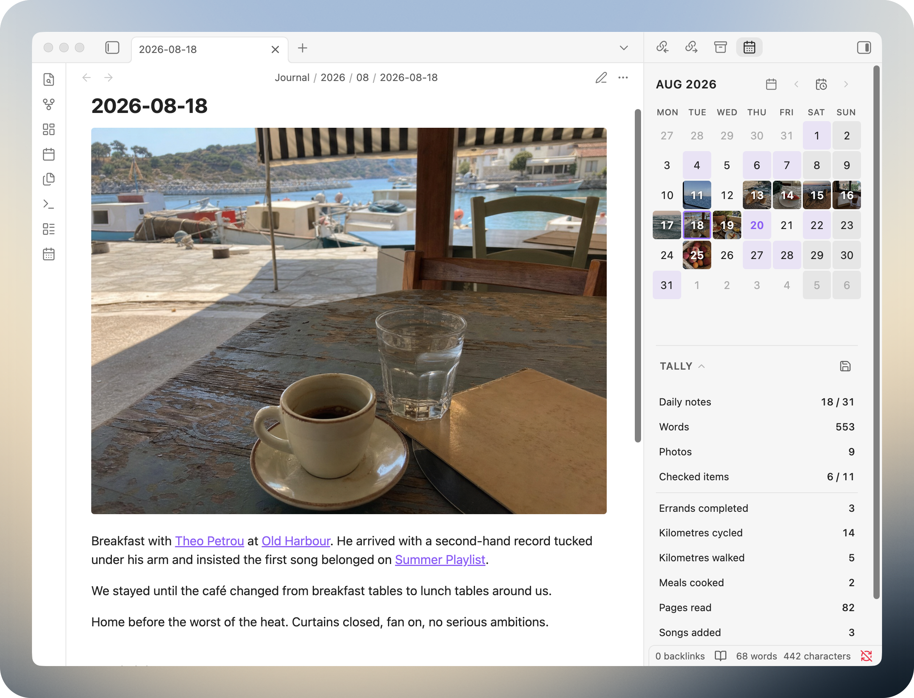
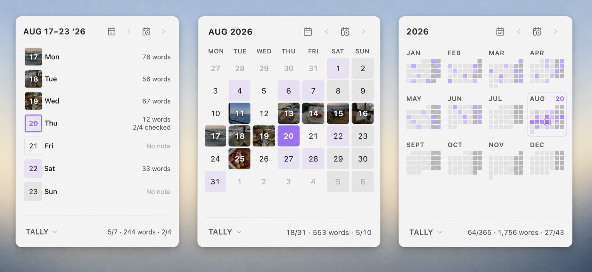
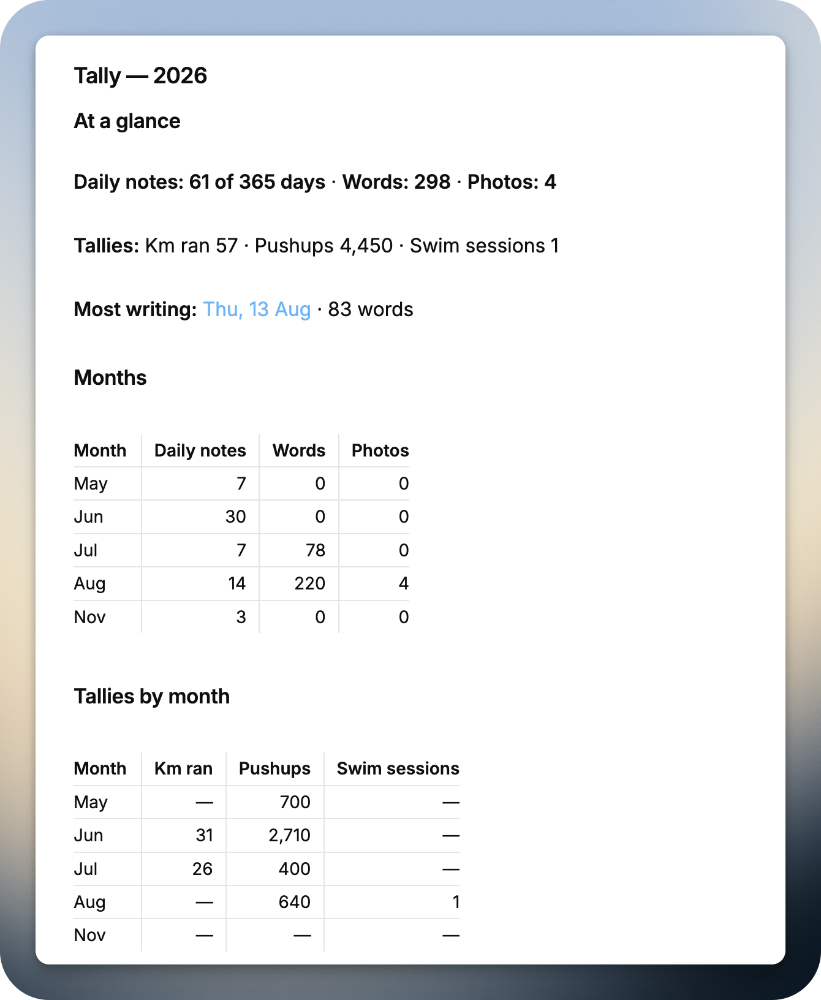

# Daymark

Daymark is a calm, local-first journal for Obsidian. It keeps your dated Markdown notes close at hand with Week, Month, and Year calendars, quick capture, and simple Tally summaries—all in one sidebar.

There are no accounts, analytics, or network requests. Your journal stays in ordinary Markdown files inside your vault.



## Calendar

Open Daymark from the ribbon or run **Daymark: Open calendar**.

- Switch between Week, Month, and Year.
- See which days already have notes, with optional image covers.
- Use the arrow buttons or **Today** to move around the calendar.
- Click a date to open its note. If it does not exist, Daymark asks before creating it.
- Choose the first day of the week and softly shade recurring days such as weekends.

Year view brings all twelve months together in a compact activity overview. The selected or open day appears beside its month label, and selecting a month opens it at full size.



Daymark follows your chosen journal folder and date format, including nested paths such as `YYYY/MM/YYYY-MM-DD`. It does not require Obsidian's Daily Notes plugin or another calendar plugin.

New notes can use a Markdown template with these variables:

```text
{{date}}
{{date:dddd, D MMMM YYYY}}
{{time}}
{{time:HH:mm}}
{{title}}
```

## Quick Log

Run **Daymark: Quick log** to add a short, timestamped thought to today's note without changing views:

```markdown
`09:05` — A thought worth keeping
```

If today's note does not exist, Daymark asks before creating it. Quick Log, **Open today’s note**, and **Go to date** can all be assigned shortcuts in Obsidian.

## Tally

Tally unfolds beneath the calendar and follows the same Week, Month, or Year. It summarizes:

- Daily notes
- Words
- Photos embedded in daily notes
- Checked items without hashtags
- Tagged counters from checked lines

Name each tag after the thing being counted. For example:

```markdown
- [x] Cycled 14 km #kilometres-cycled
- [x] Greek lesson #language-lessons
```

This adds `14` to Kilometres cycled. A checked tagged line without a number adds `1`, so the second line adds one Language lesson. Tagged lines belong only to their tagged counter; they are not counted a second time under Checked items. Checked items is reserved for ordinary checkbox lines without hashtags.

Photos counts local image embeds in your daily notes, including cover images. Select **Save** to create a clean Markdown report with an at-a-glance summary and chronological activity and Tally tables for Days, Weeks, or Months. Daymark will not overwrite an ordinary note that happens to share a report filename.



Use **Display names** in Daymark settings to rename Daily notes, Words, Photos, or any discovered hashtag without changing your notes. For example, Photos can appear as **Images**, and `#running` can appear as **Kilometres run**, in both the sidebar and saved reports. Clearing a name restores Daymark’s automatic one.

You can also choose one additional writing folder for a separate, all-time word count. It never changes journal totals or saved reports.

## Settings

You can choose your daily-note folder, template, date format, first weekday, recurring-day shading, note covers, calendar totals, Tally display names, and an optional additional writing folder.

Daymark counts journal prose while ignoring frontmatter, code, URLs, images, Markdown list lines, and formatting characters.

## Installation

### Install a release manually

1. Download `manifest.json`, `main.js`, and `styles.css` from the [latest release](https://github.com/justgregb/obsidian-daymark/releases/latest).
2. Create this folder inside your vault:

```text
<vault>/.obsidian/plugins/daymark/
```

3. Copy the three downloaded files into that folder.
4. Reload Obsidian, then enable **Daymark** under **Settings → Community plugins**.

All three files are required. If `styles.css` is missing, Daymark will load without its layout and visual styling.

### Build from source

Building Daymark requires Git and Node.js.

```sh
git clone https://github.com/justgregb/obsidian-daymark.git
cd obsidian-daymark
npm ci
npm run build
npm test
npm run lint
```

After the build succeeds, copy `main.js`, `manifest.json`, and `styles.css` into `<vault>/.obsidian/plugins/daymark/`. Reload Obsidian, then enable Daymark.

## Privacy and safety

- Daymark works locally through Obsidian's vault APIs.
- It reads only the configured journal and optional additional writing folder.
- Calendar navigation never changes an existing note.
- A missing daily note is created only after confirmation.
- Quick Log appends only after you select **Add**.
- Tally writes a report only after you select **Save**.
- Daymark includes no analytics, telemetry, remote APIs, or network code.

## Compatibility

- Obsidian 1.4.10 or newer
- Desktop and mobile

## Support

Daymark is free and open source. If it makes journaling a little nicer, you can [buy me a coffee on Ko-fi](https://ko-fi.com/iamgregb). ☕️

## Release status

Version `0.2.2` is available as a manual GitHub release. Daymark has not yet been submitted to Obsidian's community plugin directory.

## License

MIT
