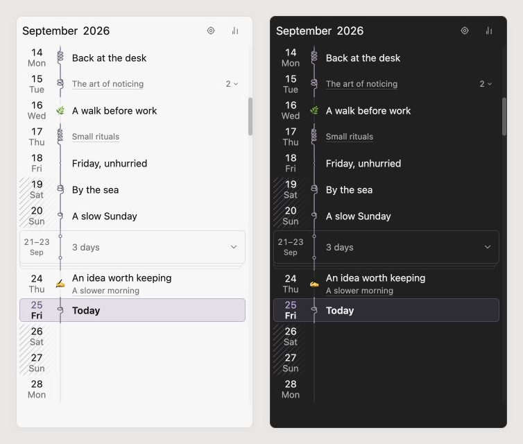
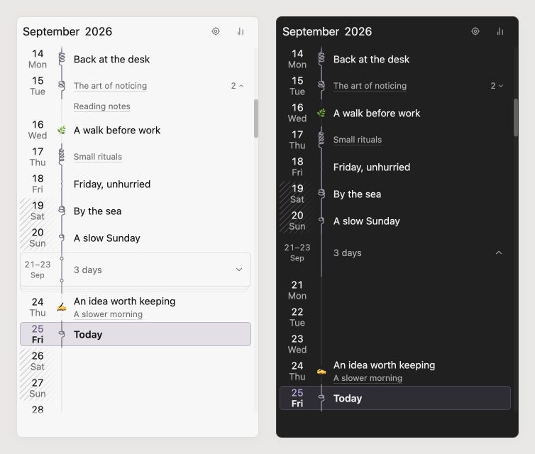

# Daymark

Daymark brings a calm calendar to your daily notes. Browse your journal in Week, Month, or Year view with optional image covers, or choose Margin for a continuous timeline with a coiled spine, day names, linked notes, and folded gaps.

Quick Log adds timestamped thoughts to today's note. Tally summarizes writing, photos, checked items, and tagged activities for the selected week, month, or year, and can save those summaries as Markdown reports.

Use your existing journal folder, date format, and daily-note template, including nested paths. Daymark opens existing notes immediately and asks before creating a missing one.


## Calendar

Open Daymark from the ribbon or run **Daymark: Open calendar**.

- Switch between Week, Month, and Year.
- See which days already have notes, with optional image covers.
- Use the arrow buttons or **Today** to move around the calendar.
- Click a date to open its note. If it does not exist, Daymark asks before creating it.
- Choose the first day of the week and softly shade recurring days such as weekends.

Year view brings all twelve months together in a compact activity overview. The selected or open day appears beside its month label, and selecting a month opens it at full size.


### Margin layout

A new way to browse your journal, inspired by the edge of a notebook.

Margin turns your daily notes into a continuous timeline. Compact dates sit beside a coiled spine that reflects how much you’ve written. Give memorable days a name, start with an emoji to place it on the spine, and open linked notes directly from the sidebar.

Past gaps of three or more days without notes or names fold into small paper stacks. Unfold them whenever you want to revisit a date. Textured shading marks your chosen recurring days, such as weekends, and the Today button brings you back without creating a note.

Tally is close at hand, too: open your monthly summary and select a metric to see its daily values along the timeline. Margin follows your Obsidian theme and works on desktop and mobile.

Enable **Settings → Daymark → Calendar layout → Margin**. Standard remains the default and keeps the Week, Month, and Year views.



Scroll to browse months; the fixed header follows the middle of the viewport. The Locate button returns to today without opening a note or prompting to create one. Click a date or its spine to open the daily note; missing notes still require confirmation.

#### Names and linked notes

Give a day an optional name without changing its Markdown note. Click the name area or press **F2** on a focused date to edit. **Enter** or leaving the field saves; **Escape** cancels. Start with an emoji, such as **📖 Finished Dune**, to place the first emoji on the spine and the remaining text beside it. Today is the default label for the current day; a custom name replaces it.

Directly linked local Markdown notes appear as smaller, dotted-underlined titles. The first is always visible, beneath a saved name or beside an unnamed date. Click a title to open it; Ctrl/Cmd-click opens a new tab. A count and chevron reveal additional titles without overlapping later days. Hovering a title reveals its full name and folder.

**Days with linked notes have no pencil.** On mobile, tap an existing day name or **Today** to rename it; tapping a linked title opens that note. On desktop, use the day’s context menu for naming and renaming: right-click the row and choose **Name day**, **Rename day**, or **Clear name**. Shift+F10 and the keyboard menu key open the same menu. Other days retain direct naming and F2.

Names are stored in local plugin settings. Naming or clearing a name never creates, renames, or edits a note. Full emoji sequences remain intact and appear only once while editing.

#### Writing and recurring days

The spine reflects prose in the daily note plus its directly linked local Markdown notes. Short notes stay straight or gently bowed; full coils appear at 120, 200, 320, 480, and 700 words. Each date has a varied wire shape that stays stable while the view is open. A leading name emoji replaces its coil. Hovering the spine shows writing and photo counts; a dotted mark indicates linked writing is loading or unavailable. Extra linked words do not change Tally reports.

**Shade recurring days** adds the spine’s blue-tinted paper grain behind chosen weekdays. Adjacent shaded dates share a continuous pattern. Selection, Today, and editing replace the grain. The interface follows Obsidian’s fonts and theme colors, with compact desktop rows and larger touch targets.

#### Folded gaps

Past runs of **three or more consecutive dates without daily notes or names** fold into a small paper stack. The current two-circle binding and straight, stepped page edges distinguish a gap from writing coils. Click or tap the stack to unfold it; the same control folds it again. Its count and position stay stable, and expansion lasts for the view session.

Existing notes remain visible even when blank or unnamed. Today, future dates, selection, and active name editing also stay visible. Runs stop at month boundaries. Creating a note or naming a day reveals that date and updates the remaining stacks. Folding changes only the timeline.



The Margin screenshots use fictional demo data.

#### Tally in Margin

With **Show Tally** enabled, the chart button opens a monthly summary. Select a metric or custom tag to show daily bars and values beside the spine. Select the same metric again to return to names. A recorded zero appears as **0**; a day without a matching value stays blank. Each month uses its own scale.

The summary follows the header month and preserves custom display names, **Save**, and the separate all-time additional-writing total. **Daymark: Open Tally** opens this summary in Margin. Switching back to Standard restores its normal calendar and Tally expansion preference.

Margin preserves the visible date through refreshes, folds, and linked-list expansion. It retains nearby months, caches writing shapes and measured row heights, and updates changed dates in place. Today updates after midnight or waking Obsidian. The daily calendar appears before background linked-writing counts finish. See [performance notes](docs/performance.md) for the implementation limits and repeatable checks.


Daymark follows your chosen journal folder and date format, including nested paths such as `YYYY/MM/YYYY-MM-DD`. It does not require Obsidian's Daily Notes plugin or another calendar plugin.

New notes can use a Markdown template with these variables:

```text
{{date}}
{{date:dddd, D MMMM YYYY}}
{{time}}
{{time:HH:mm}}
{{title}}
```

## Quick Log

Run **Daymark: Quick log** to add a short, timestamped thought to today's note without changing views:

```markdown
`09:05` — A thought worth keeping
```

If today's note does not exist, Daymark asks before creating it. Quick Log, **Open today’s note**, and **Go to date** can all be assigned shortcuts in Obsidian.

## Tally

In Standard layout, Tally unfolds beneath the calendar and follows the same Week, Month, or Year. In Margin, it opens as a monthly summary with optional daily lenses. It summarizes:

- Daily notes
- Words
- Photos embedded in daily notes
- Checked items without hashtags
- Tagged counters from checked lines

Name each tag after the thing being counted. For example:

```markdown
- [x] Cycled 14 km #kilometres-cycled
- [x] Greek lesson #language-lessons
```

This adds `14` to Kilometres cycled. A checked tagged line without a number adds `1`, so the second line adds one Language lesson. Tagged lines belong only to their tagged counter; they are not counted a second time under Checked items. Checked items is reserved for ordinary checkbox lines without hashtags.

Photos counts local image embeds in your daily notes, including cover images. Select **Save** to create a clean Markdown report with an at-a-glance summary and chronological activity and Tally tables for Days, Weeks, or Months. Daymark will not overwrite an ordinary note that happens to share a report filename.


Use **Display names** in Daymark settings to rename Daily notes, Words, Photos, or any discovered hashtag without changing your notes. For example, Photos can appear as **Images**, and `#running` can appear as **Kilometres run**, in both the sidebar and saved reports. Clearing a name restores Daymark’s automatic one.

You can also choose one additional writing folder for a separate, all-time word count. It never changes journal totals or saved reports.

## Settings

You can choose your daily-note folder, template, date format, first weekday, recurring-day shading, note covers, calendar totals, Tally display names, and an optional additional writing folder.

Daymark counts journal prose while ignoring frontmatter, code, URLs, images, Markdown list lines, and formatting characters.

## Installation

### Install a release manually

1. Download `manifest.json`, `main.js`, and `styles.css` from the [latest release](https://github.com/justgregb/obsidian-daymark/releases/latest).
2. Create this folder inside your vault:

```text
<vault>/.obsidian/plugins/daymark/
```

3. Copy the three downloaded files into that folder.
4. Reload Obsidian, then enable **Daymark** under **Settings → Community plugins**.

All three files are required. If `styles.css` is missing, Daymark will load without its layout and visual styling.

Release assets are built and attested by GitHub Actions. After downloading an asset, you can verify its source with `gh attestation verify <file> -R justgregb/obsidian-daymark`.

### Build from source

Building Daymark requires Git and Node.js.

```sh
git clone https://github.com/justgregb/obsidian-daymark.git
cd obsidian-daymark
npm ci
npm run build
npm test
npm run lint
```

After the build succeeds, copy `main.js`, `manifest.json`, and `styles.css` into `<vault>/.obsidian/plugins/daymark/`. Reload Obsidian, then enable Daymark.

For Margin layout QA, run `node scripts/build-margin-fixture.mjs` and serve the repository locally. `tests/visual/daymark-margin.html` renders the production margin component and stylesheet at 200px, 285px, and 320px in light and dark themes.

Add `?linked=1&mobile=1` for eight fictional mobile row cases, with browser geometry checks for row height, overflow, overlapping controls, and clipped text. The cases cover names with and without emoji, long names, one or several links, unnamed and emoji-only days, Today, and ordinary rows. Add `&large=1` for larger fonts; omit `mobile=1` for desktop. These checks use the shared renderer and shipped CSS, with no vault-specific styles or data.

Public descriptions live in `public-copy.json`. After editing it, run `npm run copy:sync` to update local surfaces and `npm run copy:show` to print the GitHub and Community Directory text. Production builds fail if the local copy has drifted.

## Privacy and safety

- Daymark works locally through Obsidian's vault APIs.
- It reads the configured journal, optional additional writing folder, and directly linked local Markdown notes for Margin writing marks.
- Optional day names are saved in plugin settings and never change Markdown notes.
- Calendar navigation never changes an existing note.
- A missing daily note is created only after confirmation.
- Quick Log appends only after you select **Add**.
- Tally writes a report only after you select **Save**.
- Daymark includes no analytics, telemetry, remote APIs, or network code.

## Compatibility

- Obsidian 1.13.0 or newer
- Desktop and mobile

## Support

Daymark is free and open source. If it makes journaling a little nicer, you can [buy me a coffee](https://ko-fi.com/iamgregb). ☕️

## Release status

Version `0.3.2` fixes oversized mobile Margin rows, restores direct renaming for mobile day names above linked notes, and keeps recurring-day shading visible when a day is selected or marked Today. Release downloads are published on the [GitHub releases page](https://github.com/justgregb/obsidian-daymark/releases).

## License

MIT
